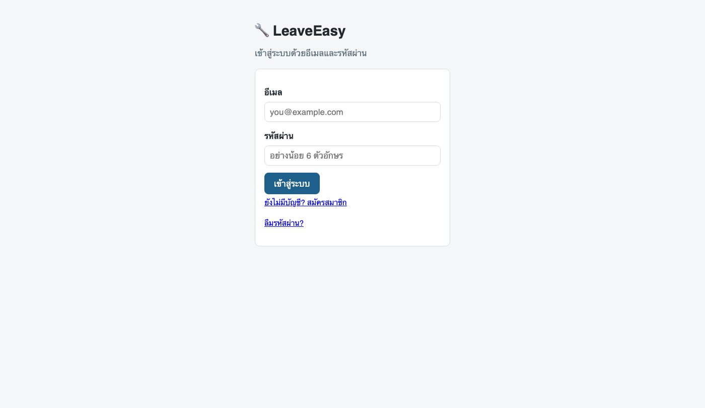
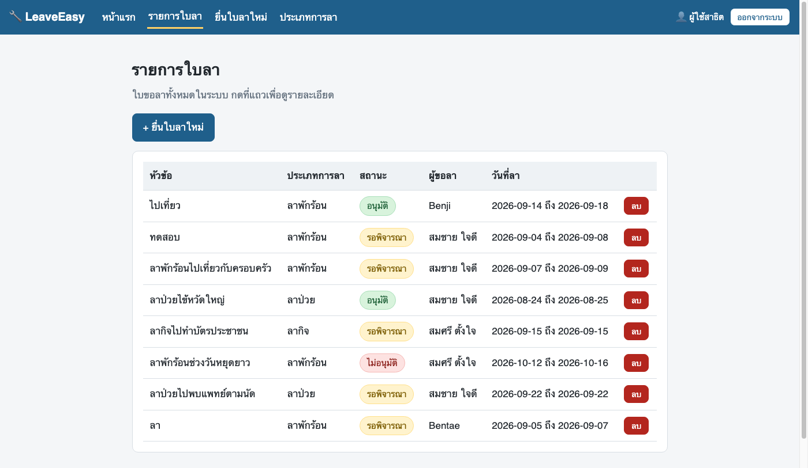

## 🌐 เว็บออนไลน์ (ใช้งานได้จริง): **https://leaveeasy-jirapan.web.app**

---

# 🔧 LeaveEasy — จุดเริ่มต้นของใบงาน

**ADT-RAISE Non-Degree Batch 2 · Module 2: MVP-Ready** (สัปดาห์ที่ 6–9)

**ผู้เรียน:** จิราพรรณ ตันปิทา

---

## 📌 ความคืบหน้าของผม

### สัปดาห์ที่ 6 — ต่อ Firestore แล้ว ✅

- เชื่อมโครงงานกับ Firebase โครงการ `leaveeasy-jirapan` — ดู `js/firebase.js`
- ใส่ข้อมูลตัวอย่าง **15 ไฟล์** ลง Firestore ผ่านหน้า `seed.html`
  (users 3 · leaveTypes 3 · leaveRequests 5 · approvals 4 ในโฟลเดอร์ย่อย)
- **หน้ารายการใบลาอ่านจากฐานข้อมูลจริงแล้ว** ไม่ใช่ข้อมูลปลอมใน `js/data.js`
  แก้ข้อมูลใน Firebase Console แล้วกด F5 หน้าเว็บเปลี่ยนตาม

หน้าอื่นยังใช้ข้อมูลปลอมอยู่ ตามขอบเขตที่ข้อกำหนดหัวข้อ 8 กำหนดไว้ว่าสัปดาห์นี้ทำแค่ตัว R

### สัปดาห์ที่ 7 — ล็อกอิน · CRUD ครบ · ขึ้นออนไลน์แล้ว ✅

- ล็อกอินด้วยอีเมล/รหัสผ่านของ Firebase Authentication (สมัคร/เข้า/ออก/ลืมรหัสผ่าน)
- ยื่นใบลา · อนุมัติ/ไม่อนุมัติ · ลบใบลา (มีหน้าต่างยืนยันก่อนลบทุกครั้ง) — เขียนลง Firestore จริงทั้งหมด
- Firestore Security Rules ขั้นต่ำ: **ต้องล็อกอินก่อน ถึงจะอ่าน/เขียนได้**
- ขึ้น Firebase Hosting แล้วที่ **https://leaveeasy-jirapan.web.app**

**หลักฐานว่าใช้งานได้จริงบนเว็บที่ deploy แล้ว:**

| หน้าเข้าสู่ระบบ | หน้ารายการใบลา (ข้อมูลจริงจาก Firestore) |
|---|---|
|  |  |

### วิธีเปิดดูเว็บ

```
npx serve -l 3001 .
```
แล้วเปิด http://localhost:3001

> ⚠️ **ตอนนี้ดับเบิลคลิกไฟล์เปิดไม่ได้แล้ว** — ต้องเปิดผ่านเซิร์ฟเวอร์เท่านั้น
> เพราะโค้ดที่ต่อ Firebase เป็น module ซึ่งเบราว์เซอร์บล็อกเมื่อเปิดแบบ `file://`

### หน้าเครื่องมือ

`seed.html` — หน้าใส่ข้อมูลตัวอย่างลง Firestore กดซ้ำได้ข้อมูลไม่ซ้ำ
ถ้าข้อมูลรวนหรือลบไปโดยไม่ตั้งใจ กดปุ่มในหน้านี้ใส่กลับได้เลย

นี่คือ **เว็บ prototype ของระบบขอลาออนไลน์** ที่ทุกคนจะใช้เป็นจุดเริ่มต้นในคาบ Workshop บ่ายวันเสาร์
เขียนด้วย **HTML · CSS · JavaScript ธรรมดา** ไม่มี framework ไม่มีขั้นตอน build

---

## 👉 เริ่มยังไง

**อย่า clone repo นี้ตรง ๆ** — ให้ **กดปุ่ม `Fork`** มุมขวาบนก่อน เพื่อให้ได้ repo เป็นของคุณเอง
แล้วทำงานใน repo ของคุณตลอด 4 สัปดาห์

> 📌 **ผู้สอนตรวจงานจาก repo ที่คุณ fork ไป** — ดูว่า commit เป็นชื่อคุณจริงไหม ไฟล์ครบไหม
> ใบงานที่ 1 ขั้น A1 จะพาทำทีละขั้น เปิดใบงานตามไปพร้อมกัน

### เปิดดูหน้าเว็บ

พิมพ์บอก Claude Code ในโฟลเดอร์นี้ว่า

```
ช่วยเปิดเว็บนี้ให้ผมดูในเบราว์เซอร์หน่อย
```

**คุณไม่ต้องจำคำสั่งอะไรเลย** — เครื่องมือที่ขาด ให้ Claude ตรวจและติดตั้งให้

---

## 📁 ในโฟลเดอร์นี้มีอะไร

```
index.html                    หน้าแรก · รวมลิงก์ไปหน้าอื่น
leave-requests.html           รายการใบลาทั้งหมด
new-leave-request.html        ฟอร์มยื่นใบลา
leave-request-detail.html     รายละเอียดใบลา 1 ใบ
leave-types.html              ประเภทการลา

css/style.css                 หน้าตาของทุกหน้า
js/data.js                    ⚠️ ข้อมูลปลอมที่พิมพ์ค้างไว้ในไฟล์
js/*.js                       โค้ดของแต่ละหน้า
leaveeasy-spec.md             📄 ข้อกำหนดของระบบ — ชื่อโฟลเดอร์ ชื่อช่องข้อมูล สถานะ
```

> 💡 **`leaveeasy-spec.md` สำคัญกว่าที่คิด** — เปิดไว้ในโฟลเดอร์เดียวกัน
> เวลาสั่งงาน Claude มันจะอ่านไฟล์นี้เองแล้วใช้ชื่อช่องข้อมูลได้ถูกต้อง
> คุณไม่ต้องพิมพ์ชื่อช่องยาว ๆ เองทุกครั้ง

---

## ⚠️ ตอนนี้ระบบยังไม่มีความจำ

ลองเปิด **ยื่นใบลาใหม่** → กรอกอะไรก็ได้ → กดบันทึก → **กด F5 รีเฟรช**
ข้อมูลที่เพิ่งกรอกจะหายหมด เพราะข้อมูลทั้งหมดยังเป็นของปลอมที่พิมพ์ค้างไว้ใน `js/data.js`

**นั่นคือสิ่งที่คุณจะแก้ในสัปดาห์ที่ 6** — ต่อระบบเข้ากับคลังเก็บข้อมูลจริง

---

## 🗓️ 4 สัปดาห์นี้คุณจะทำอะไรกับมัน

| สัปดาห์ | สิ่งที่ระบบจะทำได้เพิ่ม |
|:-:|---|
| **6** | เก็บข้อมูลลงคลังจริง · หน้ารายการอ่านจากคลัง ไม่ใช่ข้อมูลปลอม |
| **7** | เพิ่ม แก้ ลบ ได้จริง · ล็อกอิน · ขึ้นออนไลน์ให้คนอื่นเปิดได้ |
| **8** | ปิดข้อมูลไม่ให้คนอื่นอ่านของเรา · ใส่ปุ่มผู้ช่วย AI |
| **9** | ให้ AI ทดสอบระบบแทนเรา · เก็บของส่งมอบ |

**ใบงานของแต่ละสัปดาห์จะพาทำทีละขั้น** — ไม่ต้องทำล่วงหน้า และไม่ต้องเดาเอง

---

## 🔗 ลิงก์

- 📚 **คลังสื่อการสอน Module 2** — https://cnacha-mfu.github.io/raise2-module2/
- 💬 **จองคิว Consult รายคน** — https://raise2-58508.web.app
- 🧪 **ดูหน้าตา prototype ก่อน** — https://cnacha-mfu.github.io/raise2-module2/materials/shared/prototypes/leaveeasy/

---

## 🧑‍🌾 ถ้าคุณไม่เคยเขียนโปรแกรมมาก่อน

หลักสูตรนี้ออกแบบมาเพื่อคุณโดยเฉพาะ · สิ่งที่คุณต้องฝึกคือ **การอ่านแล้วบอกว่าอะไรขาด** ไม่ใช่การจำคำสั่ง

วิธีทำงานทั้งหลักสูตรคือ **วงจร 4 จังหวะ**

```
1️⃣ บอกเป้าหมายสั้น ๆ → 2️⃣ AI เขียนแผนมาให้ → 3️⃣ เราอ่านและแก้แผน → 4️⃣ สั่งลงมือทีละข้อ
```

**จังหวะที่ 3 คือหัวใจ** — อย่าปล่อยให้ AI ลงมือก่อนที่คุณจะอ่านแผนจบ
